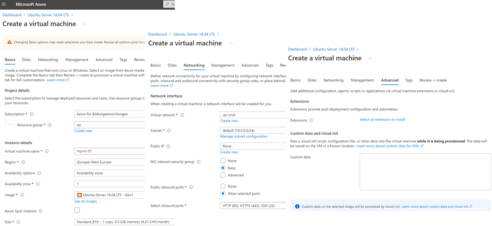
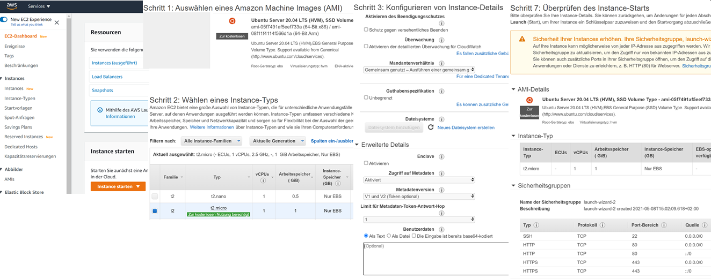

Vorbereiten
-----------

### Erstellt einen (free) Account auf einer der folgenden Cloud Plattformen:

* [Azure](https://azure.microsoft.com/en-us/free/)
* [AWS](https://aws.amazon.com/de/free/)

***
### VMs Anlegen

Macht Euch mit dem Anlegen einer virtuellen Maschine, mittels dem jeweiligen User Interface, vertraut. Als Betriebsystem verwendet Ihr **Ubuntu** Linux.

Nachdem Ihr sicher seit, wie das Anlegen funktioniert, könnt Ihr die VM wieder löschen.

**Für den Workshop ist es Vorraussetzung, dass Ihr selbstständig eine virtuelle Maschine anlegen könnt.**

#### Azure Cloud

* [VM Anlegen](https://portal.azure.com/#create/Canonical.UbuntuServer1804LTS-ARM)

#### AWS Cloud

* [VM Anlegen](https://eu-central-1.console.aws.amazon.com/ec2/v2/home?region=eu-central-1#LaunchInstanceWizard:)

***
#### Optional, nur Übungen 2 + 4

Installiert, dass zur Cloud, gehörende Kommandozeilentool (CLI) auf Eurem lokalen Notebook/PC.

* [Azure](https://docs.microsoft.com/en-us/cli/azure/install-azure-cli)
* [AWS](https://aws.amazon.com/de/cli/)

 

