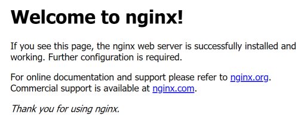
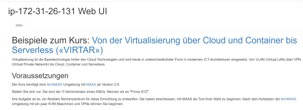

Übung 1: VM mit Services in der Cloud anlegen
---------------------------------------------

Verwendet jweils einer der nachfolgenden Cloud-init Scripte um eine Virtuelle Maschine (VM), inkl. Services, zu installieren.

### nginx Web Server

nginx ist eine von Igor Sysoev entwickelte, unter der BSD-Lizenz veröffentlichte Webserver-Software, Reverse Proxy und E-Mail-Proxy.

    #cloud-config - Installiert den nginx Web Server
    packages:
     - nginx
     
Überprüft das Ergebnis, durch Anwählen der IP-Adresse Eurer VM im Browser.

### Apache Web Server mit einer Intro Seite

    #cloud-config - Erstellt eine Intro Seite und installiert den Apache Web Server
    packages:
     - git
    runcmd:
     - git clone https://github.com/mc-b/lernmaas /home/ubuntu/lernmaas
     - git clone https://github.com/mc-b/virtar /home/ubuntu/virtar
     - cd /home/ubuntu/virtar
     - sudo bash -x /home/ubuntu/lernmaas/helper/intro
     - sudo cp -rp images /var/www/html/ 

Überprüft das Ergebnis, durch Anwählen der IP-Adresse Eurer VM im Browser.

**Links**

* [Offizielle Cloud-init Beispiele](https://cloudinit.readthedocs.io/en/latest/topics/examples.html)
* [lernMAAS und Cloud-init in der Public Cloud](https://github.com/mc-b/lernmaas/tree/master/doc/Cloud)