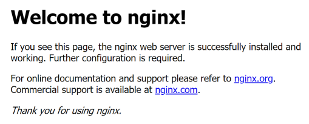
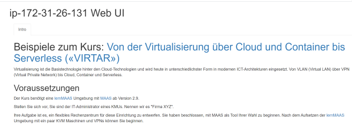

Übung 1: VM mit Services in der Cloud anlegen
---------------------------------------------

Verwendet jeweils eines der nachfolgenden Cloud-init Scripte um eine Virtuelle Maschine (VM), inkl. Services, zu installieren.

***
### nginx Web Server

nginx ist eine von Igor Sysoev entwickelte, unter der BSD-Lizenz veröffentlichte Webserver-Software, Reverse Proxy und E-Mail-Proxy.

    #cloud-config - Installiert den nginx Web Server
    packages:
     - nginx
     
Überprüft das Ergebnis, durch Anwählen der IP-Adresse Eurer VM im Browser.

***
### Apache Web Server mit einer Intro Seite

    #cloud-config - Erstellt eine Intro Seite und installiert den Apache Web Server
    packages:
     - git
    runcmd:
     - git clone https://github.com/mc-b/lernmaas /home/ubuntu/lernmaas
     - git clone https://github.com/mc-b/virtar /home/ubuntu/virtar
     - cd /home/ubuntu/virtar
     - sudo bash -x /home/ubuntu/lernmaas/helper/intro
     - sudo cp -rp images /var/www/html/ 

Überprüft das Ergebnis, durch Anwählen der IP-Adresse Eurer VM im Browser.

***
### Kubernetes

Für eine minimale Kubernetes Umgebung eignet sich [microk8s](https://microk8s.io/docs) von Ubuntu.

Das Cloud-init Script ist wie folgt:

        #cloud-config
        users:
          - name: ubuntu
            sudo: ALL=(ALL) NOPASSWD:ALL
            groups: users, admin
            home: /home/ubuntu
            shell: /bin/bash
            lock_passwd: false
            plain_text_passwd: 'password'        
        # login ssh and console with password
        ssh_pwauth: true
        disable_root: false    
        packages:
          - unzip
        runcmd:
          - sudo snap install microk8s --classic
          - sudo usermod -a -G microk8s ubuntu
          - sudo microk8s enable dns storage ingress
          - sudo mkdir -p /home/ubuntu/.kube
          - sudo microk8s config >/home/ubuntu/.kube/config
          - sudo chown -f -R ubuntu /home/ubuntu/.kube
          - sudo snap install kubectl --classic    

Anmelden mittels ssh (Mac, Linux) oder putty, bitvise (Windows). User: `ubuntu`, Password `password`.

In dieser Umgebung können wir dann z.B. einen Apache Web Server starten:

    kubectl apply -f https://raw.githubusercontent.com/mc-b/duk/master/test/apache.yaml
    
Der Port 80 des Webservices wird von Kubernetes wird automatisch auf 32xxx gemappt und kann wie folgt angezeigt werden:

    kubectl get services
    
Die IP-Adresse der VM und der anzeigte Port ergibt den URL wo der Apache Webserver läuft.

Weitere Beispiele:
* [Container Images von Docker nach Kubernetes zügeln](https://github.com/mc-b/duk/blob/master/data/jupyter/09-1-kubectl.ipynb)
* [Weitere (brauchen, teilweise, eine dukmaster Umgebung](https://github.com/mc-b/duk/tree/master/data/jupyter)

**Links**

* [Offizielle Cloud-init Beispiele](https://cloudinit.readthedocs.io/en/latest/topics/examples.html)
* [lernMAAS und Cloud-init in der Public Cloud](https://github.com/mc-b/lernmaas/tree/master/doc/Cloud)
